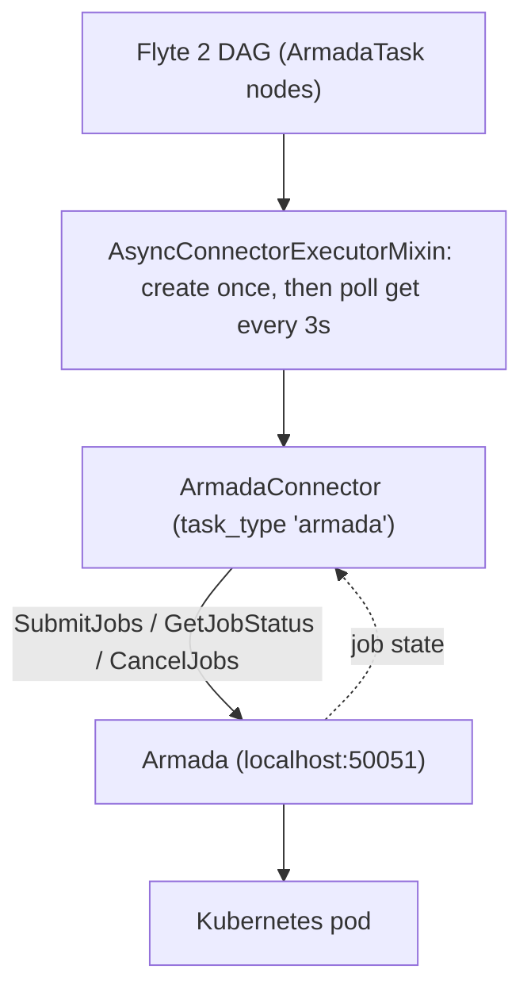

# armada-flyte

A Flyte 2 connector that runs each Flyte task as an [Armada](https://github.com/armadaproject/armada) job.

Author a DAG in pure-Python [Flyte 2](https://github.com/flyteorg/flyte). Each node is submitted
to an Armada queue, polled to completion, and its lifecycle is mapped back onto Flyte's task
phases. Flyte owns the DAG and the data flow between nodes. Armada owns scheduling and execution.

## What it does

The connector implements Flyte's three-method async connector contract. Each method is one
Armada gRPC call:

| Flyte method | Armada call         | Purpose                                         |
|--------------|---------------------|-------------------------------------------------|
| `create`     | `Submit.SubmitJobs` | Submit one Armada job, return a job handle       |
| `get`        | `Jobs.GetJobStatus` | Poll status, map the job state to a Flyte phase  |
| `delete`     | `Submit.CancelJobs` | Cancel the job                                   |

In local execution Flyte's `AsyncConnectorExecutorMixin` drives the loop in-process: it calls
`create` once, then polls `get` every 3 seconds until the task reaches a terminal phase.

`ArmadaConfig` also exposes Armada gang scheduling (`gang_id`, `gang_cardinality`): tasks sharing
a gang are scheduled all-or-nothing together. See `examples/gang_pipeline.py`.



## Quickstart

```bash
python3.11 -m venv .venv            # arm64 Python on Apple Silicon (see docs/gotchas.md)
./.venv/bin/pip install -e ".[dev]"

# with an Armada localdev stack reachable at $ARMADA_URL (default localhost:50051):
./.venv/bin/python examples/hello_world_dag.py
```

Full walkthrough, including the Armada stack: [docs/getting-started.md](docs/getting-started.md).
More examples (single task, fan-out map): [examples/](examples/).

## State mapping

| Armada JobState                 | Flyte phase        | Note                                     |
|---------------------------------|--------------------|------------------------------------------|
| `QUEUED`, `SUBMITTED`, `LEASED` | `QUEUED`           |                                          |
| `PENDING`                       | `INITIALIZING`     |                                          |
| `RUNNING`, `UNKNOWN`            | `RUNNING`          | `UNKNOWN` is transient, keep polling     |
| `SUCCEEDED`                     | `SUCCEEDED`        |                                          |
| `FAILED`, `REJECTED`            | `FAILED`           |                                          |
| `CANCELLED`                     | `ABORTED`          |                                          |
| `PREEMPTED`                     | `RETRYABLE_FAILED` | preemption is expected, so Flyte retries |

## Scope

This is the M1 shape, deliberately narrow. Each node runs a real Armada job, but with a
placeholder workload (for example `echo`). The job is genuinely submitted, scheduled, and
polled to completion. The node's output is synthesised by the connector from
`ArmadaConfig.output_template` and the node's inputs, not produced by the workload.

Running the user's actual Python inside the Armada pod (inputs and outputs through a shared blob
store, using Flyte's `a0` entrypoint) is the next step and is not in this repo yet.

## Layout

```
src/armada_flyte/
  __init__.py        registers the connector, runs the proto-compat shim first
  _proto_compat.py   aliases vendored google.api to standard before armada_client import
  connector.py       ArmadaConnector, ArmadaJobMetadata, state mapping
  task.py            ArmadaTask, ArmadaConfig (the authoring surface)
examples/            hello_world_dag, single_task, fanout_map, gang_pipeline
docs/                getting-started, gotchas
tests/               unit tests, no live Armada
```

## License

Apache-2.0. See [LICENSE](LICENSE).
