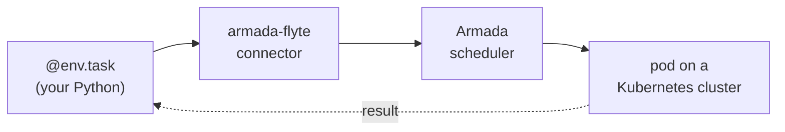

# armada-flyte

**Author in Flyte. Schedule on Armada.**

[Flyte 2](https://github.com/flyteorg/flyte) lets you write batch workflows as plain async Python.
[Armada](https://github.com/armadaproject/armada) schedules millions of jobs a day across many
Kubernetes clusters, with fair-share, gang scheduling, and preemption. `armada-flyte` connects the
two: your Flyte task runs as an Armada job, with one line of config and no new API to learn.

## The whole integration

```python
import flyte
from armada_flyte import ArmadaConfig

env = flyte.TaskEnvironment(
    "ml",
    image="armada-flyte-task:v1",
    resources=flyte.Resources(cpu=1, memory="512Mi"),
    plugin_config=ArmadaConfig(queue="ml"),   # this line routes the task to Armada
)

@env.task
async def square(x: int) -> int:
    return x * x                              # runs in an Armada-scheduled pod
```

A stock `@env.task` and one `plugin_config` line. Fan out with `asyncio.gather`, pass dataclasses
between tasks, gang-schedule a group: it is all just Flyte, running on Armada.

The connector submits to the Armada at `ARMADA_URL` (default `localhost:50051`). Point it at a
remote cluster by setting that env var, e.g. `ARMADA_URL=armada.example.com:50051`. The endpoint is
a deployment setting, not part of your task code.

## See it run

One command wires everything up, runs the task through a Flyte backend, and prints the result:

```console
$ ./demo/run.sh examples/function.py
submitted run rf6zwrmnpzpwdgnfzffn
  UI: http://localhost:30080/v2/.../runs/rf6zwrmnpzpwdgnfzffn
call price = 10.4506  (computed in an Armada pod, routed there by Flyte)
```

The run shows up in the Flyte UI, scheduled and executed by Armada. See [demo/](demo/) for the
one-time prerequisites and what the script does.

## Why both

| Flyte 2 gives you | Armada gives you |
| --- | --- |
| Pure-Python DAGs with typed I/O and async fan-out | Scheduling across many Kubernetes clusters |
| The Flyte console: runs, lineage, logs | Fair-share between queues, gang scheduling, preemption |
| Local execution for fast iteration | Battle-tested at millions of jobs a day |

You keep Flyte's authoring and console; Armada does the scheduling. No rewrite, no second SDK.

## How it works



Flyte renders each task into a self-contained container; the connector wraps it into an Armada
job, submits it, and polls to completion. The same connector runs two ways: in your process for
local runs, or as a service a deployed Flyte backend routes to.

## Next steps

- **[Run it locally, end to end](docs/getting-started.md)** - stand up Armada and run an example.
- **[Run it on a backend](demo/)** - the one-command showcase, in the Flyte UI.
- **[How it works](docs/architecture.md)** - the connector, state mapping, gang scheduling, real
  Python tasks, and current limits.
- **[Gotchas](docs/gotchas.md)** - the non-obvious environment and proto issues.
- **[Deploy the connector](deploy/)** - run it as a gRPC service or deploy it to a Flyte backend.

## License

Apache-2.0. See [LICENSE](LICENSE).
