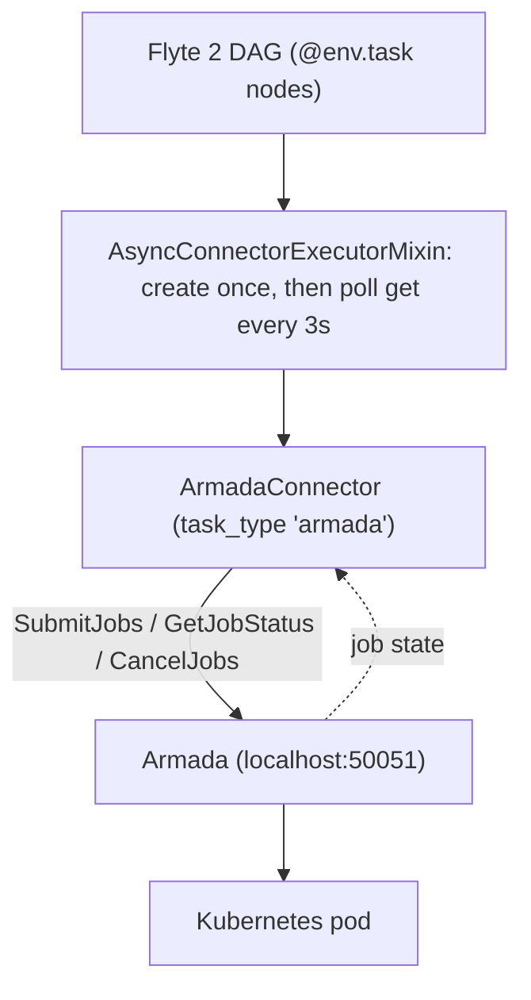

# Architecture

Flyte owns the DAG and the data flow between nodes. Armada owns scheduling and execution. The
bridge between them is a single Flyte 2 connector.

## The connector contract

Flyte 2 connectors implement three async methods. This connector maps each onto one Armada gRPC
call:

| Flyte method | Armada call         | Purpose                                         |
|--------------|---------------------|-------------------------------------------------|
| `create`     | `Submit.SubmitJobs` | Submit one Armada job, return a job handle       |
| `get`        | `Jobs.GetJobStatus` | Poll status, map the job state to a Flyte phase  |
| `delete`     | `Submit.CancelJobs` | Cancel the job                                   |

A task is routed to the connector by its `task_type`. `ArmadaFunctionTask` (registered as the plugin for `ArmadaConfig`) sets `task_type = "armada"`,
which matches `ArmadaConnector.task_type_name`. The task's `ArmadaConfig` is serialised into the
task template's `custom` field, and the connector reads it back in `create` to build the job.

## Execution model

A deployed Flyte backend (FlytePropeller) calls the connector over gRPC and the run appears in the
Flyte UI. The loop is: `create` once, then poll `get` every 3 seconds until the task reaches a
terminal phase (`SUCCEEDED`, `FAILED`, or `ABORTED`). The connector itself holds no state between
calls. The job handle it needs (`job_id`, `job_set_id`, `queue`) lives in `ArmadaJobMetadata`, which
Flyte persists between `create` and `get`/`delete`.



## State mapping

The connector maps Armada `JobState` onto Flyte's `TaskExecution.Phase`:

| Armada JobState                 | Flyte phase        | Note                                     |
|---------------------------------|--------------------|------------------------------------------|
| `QUEUED`, `SUBMITTED`, `LEASED` | `QUEUED`           |                                          |
| `PENDING`                       | `INITIALIZING`     |                                          |
| `RUNNING`, `UNKNOWN`            | `RUNNING`          | `UNKNOWN` is transient, keep polling     |
| `SUCCEEDED`                     | `SUCCEEDED`        |                                          |
| `FAILED`, `REJECTED`            | `FAILED`           |                                          |
| `CANCELLED`                     | `ABORTED`          |                                          |
| `PREEMPTED`                     | `RETRYABLE_FAILED` | preemption is expected, so Flyte retries |

Mapping `PREEMPTED` to `RETRYABLE_FAILED` is deliberate: Armada preempts jobs as part of normal
fair-share scheduling, so the node should retry rather than fail the run.

## Gang scheduling

`ArmadaConfig` exposes `gang_id`, `gang_cardinality`, and `gang_node_uniformity_label`. When a
task sets `gang_id` and a `gang_cardinality` of two or more, the connector attaches Armada's gang
annotations (`armadaproject.io/gangId`, `armadaproject.io/gangCardinality`) to the submission.
Jobs sharing a gang are scheduled all-or-nothing together.

## Python function tasks

A normal `@env.task` function can run its body inside an Armada pod. Register `ArmadaConfig` as a
`TaskEnvironment` plugin (`ArmadaFunctionTask`, wired via `TaskPluginRegistry`), then:

```python
env = flyte.TaskEnvironment("ml", image=img, plugin_config=ArmadaConfig(queue="compute"))

@env.task
async def greet(name: str) -> str:
    return f"hello {name}, from an Armada pod"
```

How it works: Flyte renders the function into a container whose entrypoint is `a0` (it loads the
code bundle, reads inputs from blob storage, runs the function, writes outputs back). The connector
wraps that rendered container into the Armada pod, adding blob-store credentials so the pod can
reach storage. The function executes in the pod and its return value flows back as the task output.
See `examples/function.py`.

This needs two things in place:

- **A blob store** (S3, GCS, or MinIO) reachable at one address by both your process (to upload
  the code bundle and inputs) and the Armada pods (to read them and write outputs). Set it with
  `flyte.init(storage=...)` and tell the connector via `FLYTE_BLOB_ENDPOINT` /
  `FLYTE_BLOB_ACCESS_KEY` / `FLYTE_BLOB_SECRET_KEY`, and use a remote `raw_data_path` (`s3://...`).
- **A task image** carrying `flyte` plus the workflow's own dependencies (including `armada_flyte`),
  available on the Armada cluster (for a local kind cluster, `kind load docker-image ...`).

## Running the connector

The connector runs as a gRPC service: a deployed Flyte backend (FlytePropeller) calls `CreateTask`
and `GetTask` on it over gRPC, and runs appear in the Flyte UI. Run it with
`c0 --modules armada_flyte.connector` or deploy it as a `ConnectorEnvironment`. See
[../deploy/](../deploy/).

## Limitations and next steps

What works today: real Armada submission, status polling, gang scheduling, DAG dataflow, in-pod
compute for `@env.task` Python functions running in
the pod (see above), and both execution modes above.

One prerequisite is outside this repo:

- **A deployed Flyte backend.** The connector is ready to deploy as a `ConnectorEnvironment` and
  serves the connector gRPC API, but automatic task routing needs a running Flyte backend
  (FlytePropeller), which this repo does not stand up.
